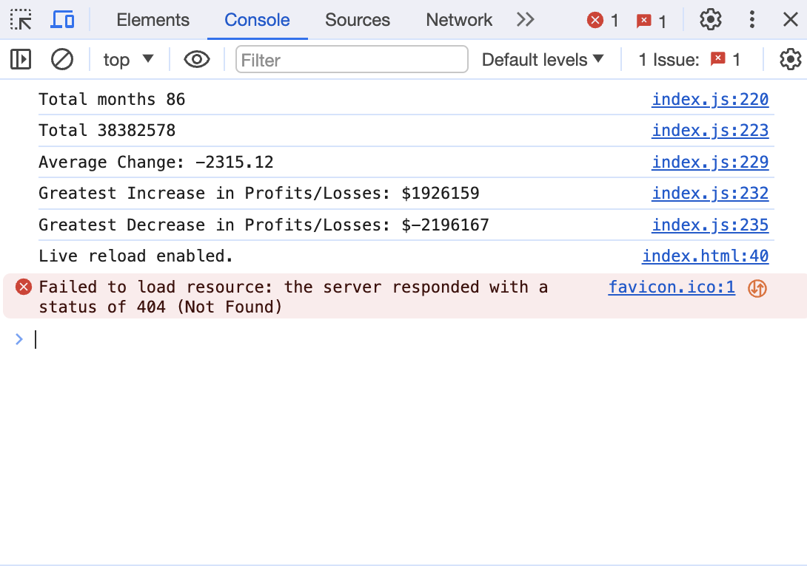

# console-finances

## Description

This week's challenge involves using javascript to log key financial metrics of data set.

## Table of Contents

- [User Story](#user-story)
- [Acceptance Criteria](#acceptance-criteria)
- [Usage](#usage)
- [Credits](#credits)
- [License](#license)

## User Story

AS A front end web developer
I WANT to be able to use javascript to analyse data sets
SO THAT I can apply these understandings to real world use cases

## Acceptance Criteria

It is done when I have successfully logged the total number of months

It is done when I have successfully logged the total profit/loss

It is done when I have successfully logged the average change

It is done when I have successfully logged the greates increase in profits / losses

It is done when I have successfully logged the greates decrease in profits / losses

## Usage

Link to deployed application - 

 

## Credits

This project was completed as part of an edX BootCamp coding challenge.

edX module slides - https://bootcampspot.instructure.com/courses/5076/modules

GitHub Pages: https://coding-boot-camp.github.io/full-stack/github/professional-readme-guide (README guidance)

Javascript functions MDN - https://developer.mozilla.org/en-US/docs/Web/JavaScript/Guide/Functions

## License

This project is licensed under the MIT License.